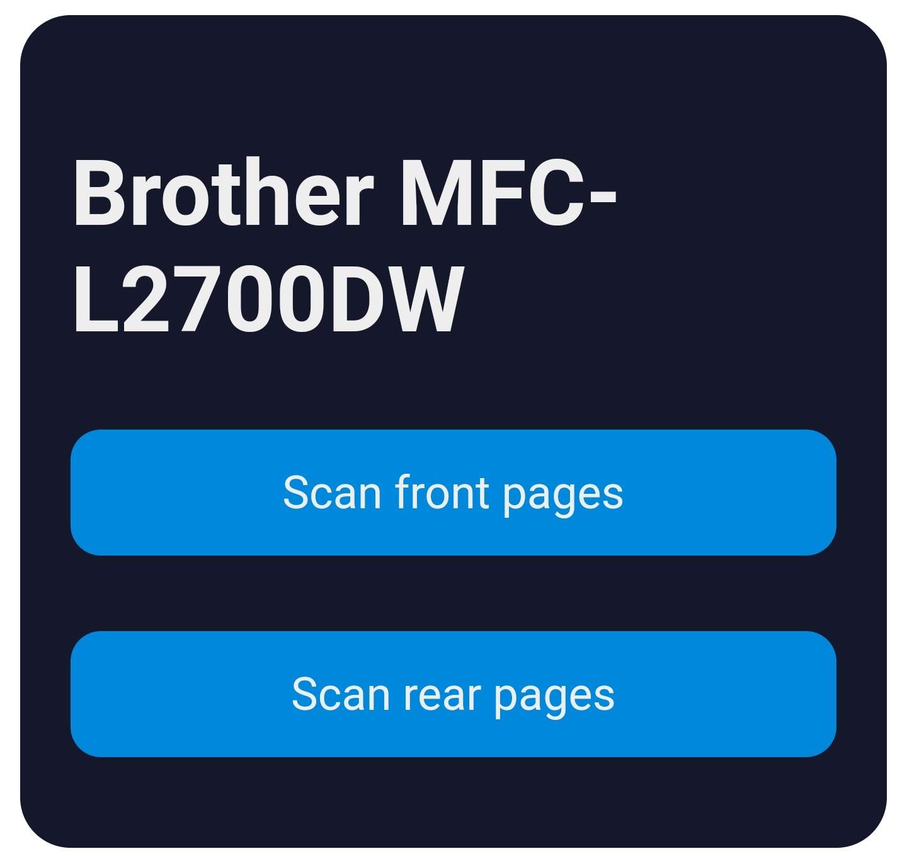

# Dockerized Brother Scanner
This is a dockerized scanner setup for Brother scanners.
It allows you to run your scan server in a Docker environment and thus also on devices such as a Synology DiskStation.
Additionally, some scripts are included that allow you to easily create duplex documents on non-duplex scanners.
A configurable web-interface is provided, allowing you to trigger scans from your smartphone or PC.

## Setup
You have two options to set up your container: Preferred and Fallback.
The preferred method is more complex but is able to address more situations, whereas the fallback method is much simpler, but might not work in all scenarios.
Both are described in the following.

### Preferred
The preferred setup is slightly more complex, but can be applied in a larger number of settings, such as containers running in virtual machines, etc.
Here, we require the IP address under which the container is reachable, as it will be contacted by the scanner, when scanning via the shortcut buttons.
This may be the IP address of the Docker host, your virtual machine containing the Docker environment, etc.
Additionally, we will need to forward the correct ports in Docker.
Consider the following docker-compose file as an example for the preferred setup:
```yaml
version: '3'

services:
    brother-scanner:
        image: ghcr.io/philippmundhenk/brotherscannerdocker
        volumes:
            - /path/on/host:/scans 
        ports:
            - 54925:54925/udp # mandatory, for scanner tools
            - 161:161/udp # mandatory, for scanner tools
        environment:
            - NAME=Scanner
            - MODEL=MFC-L2700DW
            - IPADDRESS=192.168.1.10
            - UID=1000 # note: network mount needs to have correct permissions!
            - GID=1000 # note: network mount needs to have correct permissions!
            - TZ=Europe/Berlin
            - HOST_IPADDRESS=192.168.1.20
        restart: unless-stopped
```

Here, the scanner (an MFC-L2700DW), is running on IP 192.168.1.10 and the container is reachable from the scanner via 192.168.1.20.
The startup scripts will automatically configure the included Brother tooling, to set up the scanner accordingly.

### Fallback
The fallback setup might be a little more stable, but requires that your container can be bridged to the host network, rather than using Docker NAT.
This is not possible in all situations (e.g., Docker on Win/Mac, limited underlying VM configuration, etc.).
Consider the following docker-compose file:

```yaml
version: '3'

services:
    brother-scanner:
        image: ghcr.io/philippmundhenk/brotherscannerdocker
        volumes:
            - /path/on/host:/scans 
        environment:
            - NAME=Scanner
            - MODEL=MFC-L2700DW
            - IPADDRESS=192.168.1.10
            - UID=1000 # note: network mount needs to have correct permissions!
            - GID=1000 # note: network mount needs to have correct permissions!
            - TZ=Europe/Berlin
        restart: unless-stopped
        network_mode: "host"
```

Note, that we do not need to specify the host IP address in this case, as we assume that the network is already available in the container.
The startup scripts automatically tries to guess the host interface and adjust the Brother driver settings correctly.

### Further Notes
Note that the mounted folder /scans needs to have the correct permissions.
By default, the scanner will run with user uid 1000 and gid 1000.
You may change this through setting the environment variables UID and GID.

Note that only "Scan to File" and "Scan to Email" are currently implemented.
The earlier is configured to scan the front page(s) of documents and wait up to two minutes before converting to PDF.
Within these two minutes, the latter may be called (via scanner buttons, GUI, API) to scan the rear of the same set of pages (just put the scanned stack into document feeder, no prior resorting needed).
All scans are in turn interleaved correctly and a PDF is created.
If OCR, FTP, SSH options are specified, these will be executed, as well.

There are a number of additional options explained in the following.

## Options
You can configure the tool via environment variables:

| Variable | Type | Description |
| ------------- | ------------- | ------------- |
| NAME  | mandatory | Arbitrary name to give your scanner. |
| USERNAME  | optional | Displayed on scanner, if multiple servers are running. |
| MODEL  | mandatory | Model of your scanner (e.g., MFC-L2700DW) |
| IPADDRESS | mandatory | IP Address of your scanner |
| RESOLUTION | optional | DPI resolution of scan, refer to capabilities of printer on startup |
| FTP_USER | optional | Username of an FTP(S) server to upload the completed scan to (see below) |
| FTP_PASSWORD | optional | Username of an FTP(S) server to upload the completed scan to (see below) |
| FTP_HOST  | optional | Address of an FTP(S) server to upload the completed scan to (see below) |
| FTP_PATH | optional | Path of an FTP(S) server to upload the completed scan to (see below) |
| SSH_USER | optional | Username for an SSH connection to trigger inotify (see below) |
| SSH_PASSWORD | optional | Password for an SSH connection to trigger inotify (see below) |
| SSH_HOST | optional | Address for an SSH connection to trigger inotify (see below) |
| SSH_PATH | optional | Path for an SSH connection to trigger inotify (see below) |
| OCR_SERVER | optional | Hostname of an OCR server (see below) |
| OCR_PORT | optional | Port of an OCR server (see below) |
| OCR_PATH | optional | Path of an OCR server (see below) |
| WEBSERVER_ENABLE | optional | activates GUI & API (default:false) (see below) |
| WEBSERVER_PING_ENABLE | optional | activates ping service to check if scanner offline |
| WEBSERVER_PORT | optional | sets port for webserver (default: 80) |
| WEBSERVER_LABEL_SCANTOFILE | optional | empty to hide button (default: "Scan to file") |
| WEBSERVER_LABEL_SCANTOEMAIL | optional | empty to hide button (default: "Scan to email") |
| WEBSERVER_LABEL_SCANTOIMAGE | optional | empty to hide button (default: "Scan to image") |
| WEBSERVER_LABEL_SCANTOOCR | optional | empty to hide button (default: "Scan to OCR") |
| USE_JPEG_COMPRESSION | optional | use JPEG compression when creating PDFs |

### FTPS upload
In addition to the storage in the mounted volume, you can use FTPS (Secure FTP) Upload.
To do so, set the following environment variables to your values:
```
- FTP_USER="scanner"
- FTP_PASSWORD="scanner"
- FTP_HOST="ftp.mydomain.com"
- FTP_PATH="/"
```

This only works with the scripts offered here in folder script/ (see Customize).

### Automatic Synchronization Solutions
Many automatic synchronization solutions, such as Synology CloudStation, are notified
about changes in the filesystem through inotify (see http://man7.org/linux/man-pages/man7/inotify.7.html).
As the volume is mounted in Docker, the security mechanisms isolate the host and container
filesystem. This means that such systems do not work.

To solve this issue, a simple 'sed "" -i' can be performed on the file. The scripts in folder script/ use SSH
to execute this command. This generates an inotify event, in turn starting synchronisation.
To use this option, set the following variables to your values:
```
- SSH_USER="admin"
- SSH_PASSWORD="admin"
- SSH_HOST="localhost"
- SSH_PATH="/path/to/scans/folder/"
```
Of course this requires SSH access to the host. If this is not available, consider the FTPS option.

### OCR
This image is prepared to utilize an OCR service, such as [my TesseractOCRMicroservice](https://github.com/PhilippMundhenk/TesseractOCRMicroservice).
This uploads, waits for OCR to complete and downloads the file again.
The resulting PDF file is saved in the /scans directory, with the appendix "-ocr" in the filename.
To use this option, set the following variables to your values:
```
- OCR_SERVER=192.168.1.101
- OCR_PORT=8080
- OCR_PATH=ocr.php
```
This will call the OCR service at https://192.168.1.101:8080/ocr.php.

### Webserver
This image comes with an integrated webserver, allowing you to control the scanning functions also via API or GUI.
To activate the webserver, you need to set an according environment variable.
By default, the image uses port 80, but you may configure that.
Additionally, for the GUI, you can rename and hide individual functions.
here is an example of the environment:
```
- WEBSERVER_ENABLE= # optional, activates GUI & API
- WEBSERVER_PING_ENABLE= # optional, if enabled scanner status is `online`, `offline`, `scanning` (see status.php)
- WEBSERVER_PORT=33355 # optional, sets port for webserver (default: 80)
- WEBSERVER_LABEL_SCANTOIMAGE= # optional, hides button "Scan to image"
- WEBSERVER_LABEL_SCANTOOCR= # optional, hides button "Scan to OCR"
- WEBSERVER_LABEL_SCANTOFILE="Scan front pages" # optional, renames button "Scan to file" to "Scan front pages"
- WEBSERVER_LABEL_SCANTOEMAIL="Scan rear pages" # optional, renames button "Scan to email" to "Scan rear pages"
```

#### GUI
You can access the GUI under the IP of your container and the set port (or 80 in default case).
With the full config example below, the result will look something like this:


Note that the interface does not block when pressing a button.
Thus, make sure to wait for your scan to complete, before pressing another button.

#### API
The GUI uses a minimal "API" at the backend, which you can also use from other tooling (e.g., Home Assistant or a control panel near your printer).
To scan, simply call `http://<ContainerIP>:<Port>/scan.php?target=<file|email|image|OCR>`
Also check out the endpoints `list.php`, `listfiles.php`, `download.php`, `active.php` and `status.php`.
Maybe one day an OpenAPI Spec will be included.

## Full Docker Compose Example
This docker-compose file can be run with minimal adaptions (environment variables MODEL, IPADDRESS, HOST_IPADDRESS & volume where files are to be stored):

```yaml
version: '3'

services:
    brother-scanner:
        image: ghcr.io/philippmundhenk/brotherscannerdocker
        volumes:
            - /path/on/host:/scans
        ports:
            - 33355:33355 # example webserver port
            - 54925:54925/udp # mandatory, for scanner tools
        environment:
            - NAME=Scanner
            - MODEL=MFC-L2700DW
            - IPADDRESS=192.168.1.10
            - HOST_IPADDRESS=192.168.1.20
            - OCR_SERVER=localhost # optional, for OCR
            - OCR_PORT=32800 # optional, for OCR
            - OCR_PATH=ocr.php # optional, for OCR
            - UID=1000 # optional, for /scans permissions
            - GID=1000 # optional, for /scans permissions
            - TZ=Europe/Berlin # optional, for correct time in scanned filenames
            - WEBSERVER_ENABLE= # optional, activates GUI & API
            - WEBSERVER_PING_ENABLE= # optional, activates ping service to check if scanner offline
            - PORT=33355 # optional, sets port for webserver (default: 80)
            - WEBSERVER_LABEL_SCANTOIMAGE= # optional, deactivates button "Scan to image"
            - WEBSERVER_LABEL_SCANTOOCR=true # optional, deactivates button "Scan to OCR"
            - WEBSERVER_LABEL_SCANTOFILE="Scan front pages" # optional, renames button "Scan to file" to "Scan front pages"
            - WEBSERVER_LABEL_SCANTOEMAIL="Scan rear pages" # optional, renames button "Scan to email" to "Scan rear pages"
        restart: unless-stopped

    # optional, for OCR
    ocr:
      image: ghcr.io/philippmundhenk/tesseractocrmicroservice
      restart: unless-stopped
      ports:
          - 32800:80
```

## Customize Scan Scripts
As the standard scripts might not working particularly well for your purpose, you may customize them to your needs.
You may also add additional scripts, as currently "Scan to Image" and "Scan to OCR" are not being used.
Have a look in the folder `script/` in this repository for ideas.
These scripts show some examples on how one might use the buttons on the printer.
If you change these scripts, make sure to leave the filename as is, as the Brother drivers will call these scripts (or adapt /opt/brother/scanner/brscan-skey/brscan-skey.config).
Each script corresponds to a shortcut button on the scanner. 
This way you can customize the actions running on your scanner.

Hint: These scripts don't necessarily need to do scanning tasks.
You can add any shell script here.

You may mount the scripts in this repository like this: ```-v "$PWD/script/:/opt/brother/scanner/brscan-skey/script/"```
